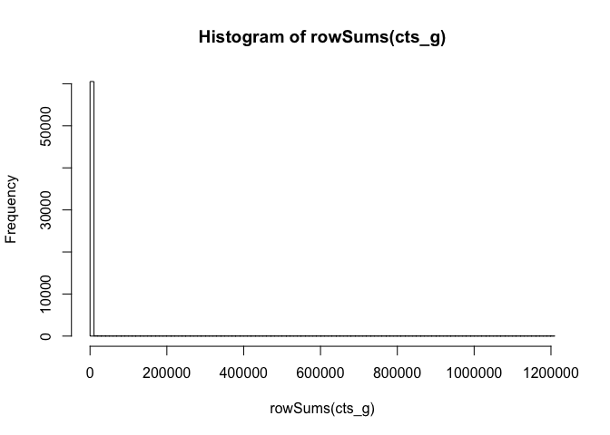
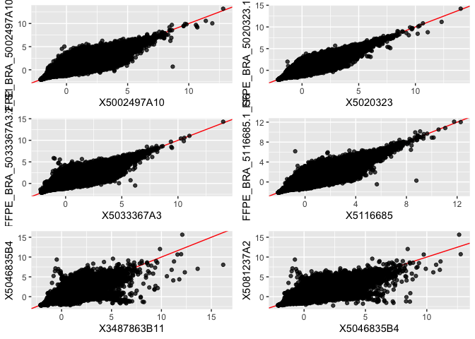
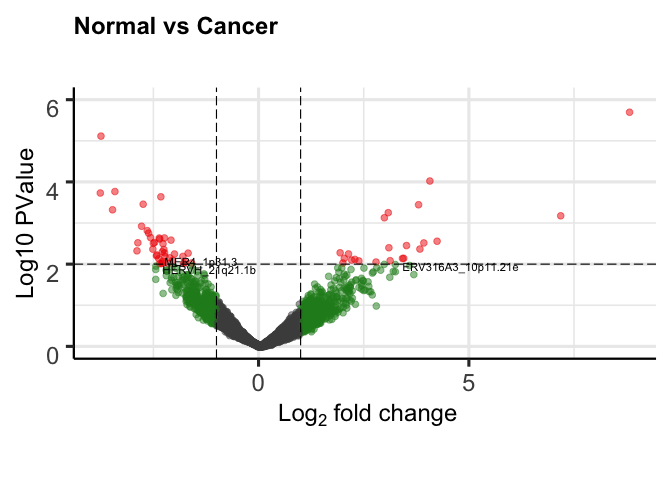

R Notebook
================

Gislaine FFPE
=============

This notebook is for the analyzes of FFPE breast samples.

Reading Gene Tables:
--------------------

``` r
read_multiple<-function(x, name, col){
  lapply(lfile, function(x) {
    z <-read.delim(x,header=T,skip=0)[,col]
    colnames(z)<-c(name,strsplit(strsplit(x,split="/")[[1]][9],split="_htseq",fixed=T)[[1]][1])
    z
  })}   #this function is for reading multiple files

lfile<-list.files(path = "/Users/luis_iniguez/Documents/WCM/FFPE_Brazil/",pattern='*_htseq.txt', recursive=T) #find all files with that name
lfile<-paste0("/Users/luis_iniguez/Documents/WCM/FFPE_Brazil/",lfile)
datatemp <- read_multiple(lfile, name="Gene", col=c(1,2)) # Read the file and extract the column 3 is for final_count and 4 the final_conf
datos<-Reduce(function(x,y) {merge(x,y, by="Gene", all=T)}, datatemp) #merge all tables into a single one
datos[is.na(datos)]<-0
datos<-datos[-grep(datos$Gene, pattern="__"),]
file1<-paste0("Gene_table_Gislaine.txt")
write.table(datos, file=file1, quote=F, sep='\t', row.names=F)
```

Reading Telescope Tables:
-------------------------

``` r
read_multiple<-function(x, name, col){
  lapply(lfile, function(x) {
    z <-read.delim(x,header=T,skip=1)[,col]
    colnames(z)<-c(name,strsplit(x,split="/")[[1]][9])
    z
  })}   #this function is for reading multiple files


lfile<-list.files(path = "/Users/luis_iniguez/Documents/WCM/FFPE_Brazil/",pattern='*_report.tsv', recursive=T) #find all files with that name
lfile<-paste0("/Users/luis_iniguez/Documents/WCM/FFPE_Brazil/",lfile)
datatemp <- read_multiple(lfile, name="Gene", col=c(1,4)) # Read the file and extract the column 3 is for final_count and 4 the final_conf
datos<-Reduce(function(x,y) {merge(x,y, by="Gene", all=T)}, datatemp) #merge all tables into a single one
datos[is.na(datos)]<-0
datos<-datos[-grep(datos$Gene, pattern="__"),]
file1<-paste0("HERV_table_Gislaine.txt")
write.table(datos, file=file1, quote=F, sep='\t', row.names=F)
```

DESeq2
------

### Input:

``` r
library(DESeq2)
```

    ## Loading required package: S4Vectors

    ## Loading required package: stats4

    ## Loading required package: BiocGenerics

    ## Loading required package: parallel

    ## 
    ## Attaching package: 'BiocGenerics'

    ## The following objects are masked from 'package:parallel':
    ## 
    ##     clusterApply, clusterApplyLB, clusterCall, clusterEvalQ,
    ##     clusterExport, clusterMap, parApply, parCapply, parLapply,
    ##     parLapplyLB, parRapply, parSapply, parSapplyLB

    ## The following objects are masked from 'package:stats':
    ## 
    ##     IQR, mad, sd, var, xtabs

    ## The following objects are masked from 'package:base':
    ## 
    ##     anyDuplicated, append, as.data.frame, basename, cbind,
    ##     colnames, dirname, do.call, duplicated, eval, evalq, Filter,
    ##     Find, get, grep, grepl, intersect, is.unsorted, lapply, Map,
    ##     mapply, match, mget, order, paste, pmax, pmax.int, pmin,
    ##     pmin.int, Position, rank, rbind, Reduce, rownames, sapply,
    ##     setdiff, sort, table, tapply, union, unique, unsplit, which,
    ##     which.max, which.min

    ## 
    ## Attaching package: 'S4Vectors'

    ## The following object is masked from 'package:base':
    ## 
    ##     expand.grid

    ## Loading required package: IRanges

    ## Loading required package: GenomicRanges

    ## Loading required package: GenomeInfoDb

    ## Loading required package: SummarizedExperiment

    ## Loading required package: Biobase

    ## Welcome to Bioconductor
    ## 
    ##     Vignettes contain introductory material; view with
    ##     'browseVignettes()'. To cite Bioconductor, see
    ##     'citation("Biobase")', and for packages 'citation("pkgname")'.

    ## Loading required package: DelayedArray

    ## Loading required package: matrixStats

    ## 
    ## Attaching package: 'matrixStats'

    ## The following objects are masked from 'package:Biobase':
    ## 
    ##     anyMissing, rowMedians

    ## Loading required package: BiocParallel

    ## 
    ## Attaching package: 'DelayedArray'

    ## The following objects are masked from 'package:matrixStats':
    ## 
    ##     colMaxs, colMins, colRanges, rowMaxs, rowMins, rowRanges

    ## The following objects are masked from 'package:base':
    ## 
    ##     aperm, apply, rowsum

``` r
library(ggplot2)
library(pheatmap)
library(cowplot)
```

    ## 
    ## ********************************************************

    ## Note: As of version 1.0.0, cowplot does not change the

    ##   default ggplot2 theme anymore. To recover the previous

    ##   behavior, execute:
    ##   theme_set(theme_cowplot())

    ## ********************************************************

``` r
library(EnhancedVolcano)
```

    ## Loading required package: ggrepel

``` r
library(org.Hs.eg.db)
```

    ## Loading required package: AnnotationDbi

    ## 

``` r
library(edgeR)
```

    ## Loading required package: limma

    ## 
    ## Attaching package: 'limma'

    ## The following object is masked from 'package:DESeq2':
    ## 
    ##     plotMA

    ## The following object is masked from 'package:BiocGenerics':
    ## 
    ##     plotMA

``` r
library(reshape2)
library(ggsignif)


cts_g<-read.delim("Gene_table_Gislaine.txt",row.names = 1)
cts_h<-read.delim("HERV_table_Gislaine.txt",row.names = 1)

identical(colnames(cts_g),colnames(cts_h))
```

    ## [1] FALSE

``` r
cts_h<-cts_h[,colnames(cts_g)]
identical(colnames(cts_g),colnames(cts_h))
```

    ## [1] TRUE

``` r
coldata<- read.delim("Sample_Annotation.txt",row.names = 1,stringsAsFactors = T)
rownames(coldata)<-gsub(rownames(coldata),pattern = "-",replacement = ".")
rownames(coldata)<-c(paste0("X",grep(rownames(coldata),pattern="^[0-9]", value=T)),grep(rownames(coldata),pattern="^[0-9]", value=T,invert=T))

identical(rownames(coldata), colnames(cts_h))
```

    ## [1] FALSE

``` r
coldata<-coldata[colnames(cts_h),]
identical(rownames(coldata), colnames(cts_h))
```

    ## [1] TRUE

``` r
coldata$Group<-factor(paste(coldata$Tissue,coldata$HIV, sep = "_"))
coldata$Run<-as.factor(coldata$Run)
levels(coldata$HIV)<-c("Negative","Positive")
levels(coldata$Tissue)<-c("Normal","Cancer")


hist(rowSums(cts_g),breaks = 100)
```



``` r
#Filter Genes which are only expressed in a single sample

cts_g<-cts_g[rowSums(cts_g>0)>2,]
cts_h<-cts_h[rowSums(cts_h>0)>2,]

boxplot(cts_g)
```


``` r
dds <- DESeqDataSetFromMatrix(countData = rbind(cts_g, cts_h),
                              colData = coldata,
                              design= ~Group+Run )
dds<-DESeq(dds)
```

    ## estimating size factors

    ## estimating dispersions

    ## gene-wise dispersion estimates

    ## mean-dispersion relationship

    ## final dispersion estimates

    ## fitting model and testing

``` r
rld <- rlog(dds, blind=TRUE) # 'regularized log' transformation
```

#### Duplicated samples

Some of the samples were sequenced two times (technical replicates) and we wanted to know how to deal with them. Correlation between all samples was calculated on the log transfromed normalized counts and used a distance for clustering. (transformation=1-correlation, this implies 0 samples are identical and 2 samples correlate perfectly negatively)

``` r
sampleDists <- 1-as.dist(cor(assay(rld)[,grep(colnames(rld), pattern="merged",invert=T, value = T)]))
dist_matrix<-as.matrix(sampleDists)

pheatmap(dist_matrix,
         clustering_distance_rows=sampleDists,
         clustering_distance_cols=sampleDists,
         annotation_row = coldata[,c("HIV","Tissue","Run")])
```


Here are the plots of all genes from one samples and its duplicate sample. Also two plots were added these are not realated samples. This exemplifies the correaltion results.

``` r
cor_list<-list()
cor_list[[1]]<-ggplot(as.data.frame(assay(rld)), aes(y=FFPE_BRA_5002497A10.2_S3,
                                                     x=X5002497A10))+
  geom_abline(intercept = 0,slope = 1,col="red")+geom_point(alpha=0.75)
cor_list[[2]]<-ggplot(as.data.frame(assay(rld)), aes(y=FFPE_BRA_5020323.1_S4,
                                                     x=X5020323))+
  geom_abline(intercept = 0,slope = 1,col="red")+geom_point(alpha=0.75)
cor_list[[3]]<-ggplot(as.data.frame(assay(rld)), aes(y=FFPE_BRA_5033367A3.2_S1,
                                                     x=X5033367A3))+
  geom_abline(intercept = 0,slope = 1,col="red")+geom_point(alpha=0.75)
cor_list[[4]]<-ggplot(as.data.frame(assay(rld)), aes(y=FFPE_BRA_5116685.1_S6,
                                                     x=X5116685))+
  geom_abline(intercept = 0,slope = 1,col="red")+geom_point(alpha=0.75)
random<-as.data.frame(assay(rld))[,c("X5046835B4","X3487863B11","X5081237A2")]
cor_list[[5]]<-ggplot(random, aes(y=random[,1],x=random[,2]))+
  xlab(colnames(random)[2])+ylab(colnames(random)[1])+
  geom_abline(intercept = 0,slope = 1,col="red")+
  geom_point(alpha=0.75)

cor_list[[6]]<-ggplot(random, aes(y=random[,1],x=random[,3]))+
  xlab(colnames(random)[1])+ylab(colnames(random)[3])+
  geom_abline(intercept = 0,slope = 1,col="red")+
  geom_point(alpha=0.75)

plot_grid(ncol=2,plotlist = cor_list)
```



We decided to merge technical replicates and treat then as one.

``` r
selected_samples<-grep(colnames(cts_g), pattern="FFPE", value=T, invert=T)[c(-3,-8,-10,-18)]

cts_g<-cts_g[,selected_samples]
cts_h<-cts_h[,selected_samples]
cts_g<-cts_g[rowSums(cts_g>0)>2,]
cts_h<-cts_h[rowSums(cts_h>0)>2,]
```

### PCA

``` r
#library(pcaExplorer)
#
#pcaExplorer(dds=dds,dst=rld,coldata = coldata)

PCA_LPI <- prcomp(t(assay(rld)))
ploting_PCA_LPI<-data.frame(PCA_LPI$x[,1:3],HIV=coldata[rownames(PCA_LPI$x),"HIV"],
                            Tissue=coldata[rownames(PCA_LPI$x),"Tissue"],
                            Group=coldata[rownames(PCA_LPI$x),"Group"],
                            Run=coldata[rownames(PCA_LPI$x),"Run"],
                            Patient=coldata[rownames(PCA_LPI$x),"Patient"])

ggplot(data=ploting_PCA_LPI)+
  geom_point(aes(x=PC1,y=PC2,colour=Group),size=4)+
  ggtitle("Genes+HERVs")+
  theme_cowplot(12)+
  theme(text = element_text(size=15))
```


``` r
temp<-assay(rld)[rownames(cts_h),]

PCA_LPI <- prcomp(t(temp))
ploting_PCA_LPI<-data.frame(PCA_LPI$x[,1:3],HIV=coldata[rownames(PCA_LPI$x),"HIV"],
                            Tissue=coldata[rownames(PCA_LPI$x),"Tissue"],
                            Group=coldata[rownames(PCA_LPI$x),"Group"],
                            Run=coldata[rownames(PCA_LPI$x),"Run"],
                            Patient=coldata[rownames(PCA_LPI$x),"Patient"])

ggplot(data=ploting_PCA_LPI)+
  geom_point(aes(x=PC1,y=PC2,colour=Group, shape=Tissue),size=4)+
  #labs(colour="HIV",shape="Tissue")+ 
  #scale_color_manual(values=c("black","red"))+
  ggtitle("HERVs")+
  theme_cowplot(12)+
  theme(text = element_text(size=15))
```


### Cancer vs Normal

Despite having other factors like patient or HIV status we decided to first ignore those components and try to look for differentially expressed genes and HERV.

``` r
dds <- DESeqDataSetFromMatrix(countData = rbind(cts_g, cts_h),
                              colData = coldata[selected_samples,],
                              design= ~Tissue )
dds<-DESeq(dds)
```

    ## estimating size factors

    ## estimating dispersions

    ## gene-wise dispersion estimates

    ## mean-dispersion relationship

    ## final dispersion estimates

    ## fitting model and testing

    ## -- replacing outliers and refitting for 741 genes
    ## -- DESeq argument 'minReplicatesForReplace' = 7 
    ## -- original counts are preserved in counts(dds)

    ## estimating dispersions

    ## fitting model and testing

``` r
rld <- rlog(dds, blind=TRUE) # 'regularized log' transformation
```

#### Differential Expression

##### Common run:

Common run with adjusted pvalue threshold of 0.05.

``` r
results<-results(dds, name  = "Tissue_Cancer_vs_Normal")
EnhancedVolcano(results,
    lab = rownames(results),
    x = 'log2FoldChange',
    y = 'padj',
    pCutoff=0.05,ylim=c(0,2.5),
    title = "Cancer vs Normal",
    subtitle = "",legendVisible = F,caption = "")
```


``` r
results[results$padj<0.05 & !is.na(results$padj),]
```

    ## log2 fold change (MLE): Tissue Cancer vs Normal 
    ## Wald test p-value: Tissue Cancer vs Normal 
    ## DataFrame with 1 row and 6 columns
    ##                            baseMean   log2FoldChange             lfcSE
    ##                           <numeric>        <numeric>         <numeric>
    ## ENSG00000172932.14 16.4155820575711 4.48275762701416 0.940192560763487
    ##                                stat               pvalue
    ##                           <numeric>            <numeric>
    ## ENSG00000172932.14 4.76791437636341 1.86142858224838e-06
    ##                                  padj
    ##                             <numeric>
    ## ENSG00000172932.14 0.0362271230677179

Only one gene DE. [ANKRD13D](https://useast.ensembl.org/Homo_sapiens/Gene/Summary?db=core;g=ENSG00000172932;r=11:67288547-67302485)

Changing the parameters to more loosen criterias (pvalue &lt; 0.01) lead to these results:

``` r
EnhancedVolcano(results,
    lab = rownames(results),
    x = 'log2FoldChange',
    y = 'pvalue',
    pCutoff=0.01,ylim=c(0,6),
    selectLab = "",title = "Cancer vs Normal",
    subtitle = "",legendVisible = F,caption = "")
```


``` r
DE_log<-results$pvalue < 0.01 & abs(results$log2FoldChange) > 1
DE_log[is.na(DE_log)]<-as.logical("FALSE")
DE_matrix<-results[DE_log,]
HERV_DE<-rownames(DE_matrix)[rownames(DE_matrix)  %in% rownames(cts_h)]
GENE_DE<-rownames(DE_matrix)[rownames(DE_matrix)  %in% rownames(cts_g)]

length(HERV_DE)
```

    ## [1] 13

``` r
length(GENE_DE)
```

    ## [1] 163

``` r
pheatmap(assay(rld)[c(HERV_DE,GENE_DE),],scale = "row",border_color = NA, 
        annotation_col = coldata[,c("HIV","Tissue")], show_rownames = F)
```


``` r
list_box<-list()
for( i in 1:length(HERV_DE)){
  x<-HERV_DE[i]
  plotthis<-melt(assay(rld)[x,])
  plotthis<-cbind(plotthis,coldata[rownames(plotthis),])
  max_plot<-max(plotthis$value)+0.5
  list_box[[i]]<-ggplot(plotthis, aes(y=value,x=Tissue))+
    geom_boxplot(outlier.shape = NA)+
    geom_point(alpha=0.75,position=position_jitter(w=0.2,h=0),size = 3)+
    geom_signif(annotations = formatC(results[x,"pvalue"], digits=1),
              y_position=max_plot, xmin=1, xmax=2)+
    ggtitle(x)+
    ylab("Regularized Log Transformation")+
    theme_cowplot(12)
}

plot_grid(ncol=4,plotlist = list_box)
```


``` r
cols <- c("ENSEMBL","SYMBOL", "GENENAME","ENTREZID")
ensid<-sapply(strsplit(GENE_DE,split = ".",fixed=T),'[[',1)
mapping2.0<-cbind(ensid,results[GENE_DE,"log2FoldChange"])
colnames(mapping2.0)<-c("ENSEMBL","log2FoldChange")
listDE<-select(org.Hs.eg.db, keys=ensid, columns=cols, keytype="ENSEMBL")
```

    ## 'select()' returned 1:many mapping between keys and columns

``` r
listDE<-merge(listDE,mapping2.0, by="ENSEMBL",all = TRUE, sort = FALSE)
write.table(listDE,file="ListDE_Genes_CancerVSNormal_DESeq2.txt",sep="\t",quote = F, row.names = F)
```

Since the results were not convicing we tried to run anoter differentiall expression analysis

EdgeR
-----

Similar as with DESeq we ignored the other factors and we focoused on cancer vs normal. exactTest was used for calculating DE.

``` r
cts_g<-read.delim("Gene_table_Gislaine.txt",row.names = 1)[,selected_samples]
cts_h<-read.delim("HERV_table_Gislaine.txt",row.names = 1)[,selected_samples]

y<-DGEList(counts=rbind(cts_g,cts_h),samples=coldata[selected_samples,],
           group=coldata[selected_samples,"Tissue"])
y <- calcNormFactors(y)
design <- model.matrix(~0+Tissue, data=y$samples)
colnames(design)<-levels(y$samples$Tissue)

keep <- filterByExpr(y)
y <- y[keep, , keep.lib.sizes=TRUE]

y <- estimateDisp(y,design)
et <- exactTest(y, pair=c("Normal","Cancer"))
et$table$padjust<-p.adjust(et$table$PValue,method = "BH")

EnhancedVolcano(et$table,
    lab = rownames(et$table),
    x = 'logFC',
    y = 'padjust',
    pCutoff=0.05, 
    ylim=c(0,6),
    ylab="Log10 adjusted pvalue",
    transcriptPointSize=2,caption="",
    title="Norma vs Cancer",
    subtitle = "",
    legendVisible = F)
```


Not good results

``` r
DE_log<-et$table$PValue < 0.01 & abs(et$table$logFC) > 1
DE_matrix<-et$table[DE_log,]
HERV_DE<-rownames(DE_matrix)[rownames(DE_matrix)  %in% rownames(cts_h)]
GENE_DE<-rownames(DE_matrix)[rownames(DE_matrix)  %in% rownames(cts_g)]

EnhancedVolcano(et$table,
    lab = rownames(et$table),
    x = 'logFC',
    y = 'PValue',
    pCutoff=0.01, 
    ylim=c(0,6),
    selectLab=HERV_DE,
    ylab="Log10 PValue",
    transcriptPointSize=2,caption="",
    title="Normal vs Cancer",
    subtitle = "",
    legendVisible = F)
```



``` r
logcpm <- cpm(y, log=TRUE)

pheatmap(logcpm[c(HERV_DE,GENE_DE),],scale = "row",border_color = NA, 
        annotation_col = coldata[,c("HIV","Tissue","Run")],show_rownames = F)
```


``` r
list_box<-list()
for( i in 1:length(HERV_DE)){
  x<-HERV_DE[i]
plotthis<-melt(logcpm[x,])
plotthis<-cbind(plotthis,coldata[rownames(plotthis),])
max_plot<-max(plotthis$value)+0.5
list_box[[i]]<-ggplot(plotthis, aes(y=value,x=Tissue))+
  geom_boxplot(outlier.shape = NA)+
  geom_point(alpha=0.75,position=position_jitter(w=0.2,h=0),size = 5, aes(color=HIV))+
  geom_signif(annotations = formatC(et$table[x,"PValue"], digits=1),
              y_position=max_plot, xmin=1, xmax=2)+
  ggtitle(x)+
  ylab("Log2 CPM")+
  theme_cowplot(12)
}

plot_grid(ncol=2,plotlist = list_box)
```


``` r
cols <- c("ENSEMBL","SYMBOL", "GENENAME","ENTREZID")
ensid<-sapply(strsplit(GENE_DE,split = ".",fixed=T),'[[',1)
mapping2.0<-cbind(ensid,et$table[GENE_DE,"logFC"])
colnames(mapping2.0)<-c("ENSEMBL","log2FoldChange")
listDE<-select(org.Hs.eg.db, keys=ensid, columns=cols, keytype="ENSEMBL")
```

    ## 'select()' returned 1:1 mapping between keys and columns

``` r
listDE<-merge(listDE,mapping2.0, by="ENSEMBL",all = TRUE, sort = FALSE)
write.table(listDE,file="ListDE_Genes_CancerVSNormal_DESeq2.txt",sep="\t",quote = F, row.names = F)
```

``` r
listDE_mod<-listDE
listDE_mod$SYMBOL[is.na(listDE_mod$SYMBOL)]<-listDE_mod$ENSEMBL[is.na(listDE_mod$SYMBOL)]
resorting<-order(as.numeric(as.character(listDE_mod$log2FoldChange)))
plotthis<-listDE_mod[resorting,c("SYMBOL","log2FoldChange")]
plotthis$log2FoldChange<-as.numeric(as.character(plotthis$log2FoldChange))
plotthis$color<-"Underexpressed"
plotthis$color[plotthis$log2FoldChange>0]<-"Overexpressed"
plotthis$SYMBOL<-factor(plotthis$SYMBOL,levels=plotthis$SYMBOL)


ggplot(plotthis, aes(x=SYMBOL,y=log2FoldChange,fill=color))+
  geom_bar(stat="identity")+
  coord_flip()+
  ylab("log2 Foldchange")+
  xlab("")+
  ggtitle("Genes DE (Normal vs Cancer)")+
  theme_cowplot(12)
```


HERV information
----------------

MER4\_1p31.3 is intronic in ENSG00000152763.17 which is not considered expressed in our analysis.

ERV316A3\_10p11.21e is intergenic.

ERVLE\_13q14.13 is intronic, part of it is reported in one transcript as an exon. Its host gene is ENSG00000170919.16 and is close to another HERV named HERVE\_13q14.13b. The HERVE is not considered expressed. The gene is not statistical significant, but it is expressed.

HERVH\_21q21.1b is intronic in ENSG00000215386.13. This gene is considered expressed but not DE in the Tissue DE test.

<!-- Boxplot -->
<!-- ```{r} -->
<!-- list_box<-list() -->
<!-- for( i in 1:length(HERV_DE)){ -->
<!--   x<-HERV_DE[i] -->
<!-- plotthis<-melt(logcpm[x,]) -->
<!-- plotthis<-cbind(plotthis,coldata[rownames(plotthis),]) -->
<!-- max_plot<-max(plotthis$value)+0.5 -->
<!-- list_box[[i]]<-ggplot(plotthis, aes(y=value,x=Tissue))+ -->
<!--   geom_boxplot(outlier.shape = NA)+ -->
<!--   geom_point(alpha=0.75,position=position_jitter(w=0.2,h=0),size = 5)+ -->
<!--   geom_signif(annotations = formatC(as.data.frame(top5000)[x,"PValue"], digits=1), -->
<!--               y_position=max_plot, xmin=1, xmax=2)+ -->
<!--   ggtitle(x)+ -->
<!--   ylab("Log2 CPM")+ -->
<!--   theme_cowplot(12) -->
<!-- } -->
<!-- plot_grid(ncol=2,plotlist = list_box) -->
<!-- ``` -->
<!-- Barplot -->
<!-- Boxplot -->
<!-- ```{r} -->
<!-- list_box<-list() -->
<!-- for( i in 1:length(HERV_DE)){ -->
<!--   x<-HERV_DE[i] -->
<!--   plotthis<-melt(assay(rld)[x,]) -->
<!--   plotthis<-cbind(plotthis,coldata[rownames(plotthis),]) -->
<!--   max_plot<-max(plotthis$value)+0.5 -->
<!--   list_box[[i]]<-ggplot(plotthis, aes(y=value,x=Tissue))+ -->
<!--     geom_boxplot(outlier.shape = NA)+ -->
<!--     geom_point(alpha=0.75,position=position_jitter(w=0.2,h=0),size = 5)+ -->
<!--     geom_signif(annotations = formatC(results[x,"pvalue"], digits=1), -->
<!--               y_position=max_plot, xmin=1, xmax=2)+ -->
<!--     ggtitle(x)+ -->
<!--     ylab("Regularized Log Transformation")+ -->
<!--     theme_cowplot(12) -->
<!-- } -->
<!-- plot_grid(ncol=4,plotlist = list_box) -->
<!-- ``` -->
<!-- Everything: -->
<!-- ```{r} -->
<!-- dds <- DESeqDataSetFromMatrix(countData = rbind(cts_g, cts_h), -->
<!--                               colData = coldata[selected_samples,], -->
<!--                               design= ~Tissue+Run ) -->
<!-- dds<-DESeq(dds,test="LRT",reduced = ~1) -->
<!-- results<-results(dds) -->
<!-- DE_log<-results$pvalue < 0.01  -->
<!-- DE_log[is.na(DE_log)]<-as.logical("FALSE") -->
<!-- DE_matrix<-results[DE_log,] -->
<!-- HERV_DE<-rownames(DE_matrix)[rownames(DE_matrix)  %in% rownames(cts_h)] -->
<!-- GENE_DE<-rownames(DE_matrix)[rownames(DE_matrix)  %in% rownames(cts_g)] -->
<!-- pheatmap(assay(rld)[c(HERV_DE,GENE_DE),], scale = "row",border_color = NA,  -->
<!--         annotation_col = coldata[,c("HIV","Tissue","Run")]) -->
<!-- library("EnhancedVolcano") -->
<!-- EnhancedVolcano(results, -->
<!--     lab = rownames(results), -->
<!--     x = 'log2FoldChange', -->
<!--     y = 'pvalue', -->
<!--     pCutoff=0.01,ylim=c(0,5), -->
<!--     selectLab=HERV_DE) -->
<!-- ``` -->
<!-- ```{r} -->
<!-- selected_samples<-grep(colnames(cts_g), pattern="FFPE", value=T, invert=T)[c(-3,-8,-10,-18)] -->
<!-- dds <- DESeqDataSetFromMatrix(countData = rbind(cts_g, cts_h), -->
<!--                               colData = coldata[selected_samples,], -->
<!--                               design= ~HIV+Run ) -->
<!-- dds<-DESeq(dds) -->
<!-- results<-results(dds, name  = "HIV_Positive_vs_Negative") -->
<!-- logic<-results[rownames(cts_h),"pvalue"]<0.05 & abs(results[rownames(cts_h),"log2FoldChange"])>1 -->
<!-- logic[is.na(logic)]<-as.logical("FALSE") -->
<!-- HERV_DE<-rownames(results[rownames(cts_h)[logic],]) -->
<!-- library("EnhancedVolcano") -->
<!-- EnhancedVolcano(results, -->
<!--     lab = rownames(results), -->
<!--     x = 'log2FoldChange', -->
<!--     y = 'pvalue', -->
<!--     pCutoff=0.01) -->
<!--     selectLab=HERV_DE) -->
<!-- plotCounts(dds,gene = "HERVH_11q22.2", normalized = F, intgroup = "Group") -->
<!-- ``` -->
<!-- ```{r} -->
<!-- library("pheatmap") -->
<!-- pheatmap(counts(dds,normalized=T)[HERV_DE,], scale = "row",border_color = NA,  -->
<!--         annotation_col = coldata[,c("HIV","Tissue")]) -->
<!-- ``` -->
<!-- Cancer vs Normal -->
<!-- HIV vs Uninfected -->
<!-- ```{r} -->
<!-- y<-DGEList(counts=rbind(cts_g,cts_h),samples=coldata[selected_samples,], -->
<!--            group=coldata[selected_samples,"HIV"]) -->
<!-- y <- calcNormFactors(y) -->
<!-- design <- model.matrix(~0+HIV, data=y$samples) -->
<!-- colnames(design)<-levels(y$samples$HIV) -->
<!-- keep <- filterByExpr(y) -->
<!-- y <- y[keep, , keep.lib.sizes=TRUE] -->
<!-- y <- estimateDisp(y,design) -->
<!-- et <- exactTest(y, pair=c("Negative","Positive")) -->
<!-- top5000<-topTags(et,n = 5000,sort.by = "PValue") -->
<!-- DE_log<-as.data.frame(top5000)[,"PValue"] < 0.01 & abs(as.data.frame(top5000)[,"logFC"]) > 1 -->
<!-- DE_matrix<-as.data.frame(top5000)[DE_log,] -->
<!-- HERV_DE<-rownames(DE_matrix)[rownames(DE_matrix)  %in% rownames(cts_h)] -->
<!-- GENE_DE<-rownames(DE_matrix)[rownames(DE_matrix)  %in% rownames(cts_g)] -->
<!-- EnhancedVolcano(as.data.frame(top5000), -->
<!--     lab = rownames(top5000), -->
<!--     x = 'logFC', -->
<!--     y = 'PValue', -->
<!--     pCutoff=0.01,  -->
<!--     ylim=c(0,6), -->
<!--     selectLab=HERV_DE, -->
<!--     title="Volcano Plot",  -->
<!--     ylab="Log10 PValue", -->
<!--     transcriptPointSize=2,caption="", -->
<!--     subtitle="Uninfected vs HIV", -->
<!--     legendVisible = F) -->
<!-- logcpm <- cpm(y, log=TRUE) -->
<!-- pheatmap(logcpm[c(HERV_DE,GENE_DE),],scale = "row",border_color = NA,  -->
<!--         annotation_col = coldata[,c("HIV","Tissue")]) -->
<!-- ``` -->
<!-- HERVH48_8q24.13 is in an intron from ENSG00000178764.8. The gene is not considered expressed. -->
<!-- ```{r} -->
<!-- list_box<-list() -->
<!-- for( i in 1:length(HERV_DE)){ -->
<!--   x<-HERV_DE[i] -->
<!-- plotthis<-melt(logcpm[x,]) -->
<!-- plotthis<-cbind(plotthis,coldata[rownames(plotthis),]) -->
<!-- max_plot<-max(plotthis$value)+0.5 -->
<!-- list_box[[i]]<-ggplot(plotthis, aes(y=value,x=HIV))+ -->
<!--   geom_boxplot(outlier.shape = NA)+ -->
<!--   geom_point(alpha=0.75,position=position_jitter(w=0.2,h=0),size = 5, aes(color=Tissue))+ -->
<!--   geom_signif(annotations = formatC(as.data.frame(top5000)[x,"PValue"], digits=1), -->
<!--               y_position=max_plot, xmin=1, xmax=2)+ -->
<!--   ggtitle(x)+ -->
<!--   ylab("Log2 CPM")+ -->
<!--   theme_cowplot(12) -->
<!-- } -->
<!-- plot_grid(ncol=1,plotlist = list_box) -->
<!-- ``` -->
<!-- Cancer vs Normal (2 approach) -->
<!-- ```{r} -->
<!-- library(edgeR) -->
<!-- y<-DGEList(counts=rbind(cts_g,cts_h),genes=c(rownames(cts_g),rownames(cts_h))) -->
<!-- y <- calcNormFactors(y) -->
<!-- design <- model.matrix(~Tissue+HIV, data=coldata[selected_samples,]) -->
<!-- rownames(design) <- colnames(y) -->
<!-- keep <- filterByExpr(y) -->
<!-- y <- y[keep, , keep.lib.sizes=TRUE] -->
<!-- y <- estimateDisp(y,design) -->
<!-- fit <- glmFit(y, design) -->
<!-- lrt <- glmLRT(fit, coef=2:3) -->
<!-- topTags(lrt) -->
<!-- top5000<-topTags(lrt,n = 5000,sort.by = "PValue") -->
<!-- DE_log<-as.data.frame(top5000)[,"PValue"] < 0.01 -->
<!-- DE_matrix<-as.data.frame(top5000)[DE_log,] -->
<!-- HERV_DE<-rownames(DE_matrix)[rownames(DE_matrix)  %in% rownames(cts_h)] -->
<!-- GENE_DE<-rownames(DE_matrix)[rownames(DE_matrix)  %in% rownames(cts_g)] -->
<!-- EnhancedVolcano(lrt$table, -->
<!--     lab = rownames(lrt$table), -->
<!--     x = 'logFC', -->
<!--     y = 'PValue', -->
<!--     pCutoff=0.01,  -->
<!--     ylim=c(0,6), -->
<!--     selectLab=HERV_DE, -->
<!--     title="Volcano Plot",  -->
<!--     ylab="Log10 PValue", -->
<!--     transcriptPointSize=2,caption="", -->
<!--     subtitle="Cancer vs Normal", -->
<!--     legendVisible = F) -->
<!-- logcpm <- cpm(y, log=TRUE) -->
<!-- pheatmap(logcpm[c(HERV_DE,GENE_DE),],scale = "row",border_color = NA,  -->
<!--         annotation_col = coldata[,c("HIV","Tissue")]) -->
<!-- logcpm[c("MER4_1p31.3","ENSG00000152763.17"),] -->
<!-- ``` -->
